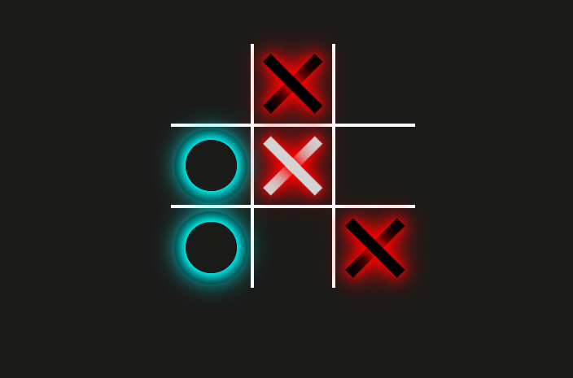
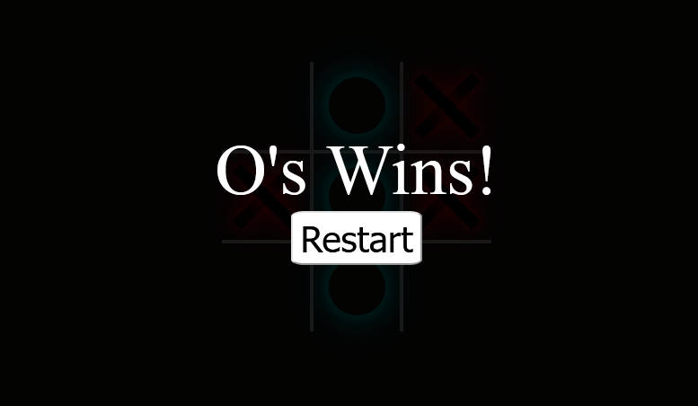

# Tic-Tac-Toe Game

This is a simple, interactive **Tic-Tac-Toe** game built using **HTML**, **CSS**, and **JavaScript**. The game is designed with responsive styling and visually appealing neon effects.

### `style.css`
The styles for the game, including:
- Responsive grid layout for the game board.
- Neon glow effects for X and O marks.
- Styling for the winning message.

### `script.js`
The logic for the game, including:
- Game flow control: turn management, win detection, and draw handling.
- Event listeners for cell clicks and restart button.
- Board hover effects to indicate the current player's turn.

### Acknowledgement
This project was inspired by and learned from by Web Dev Simplified.
